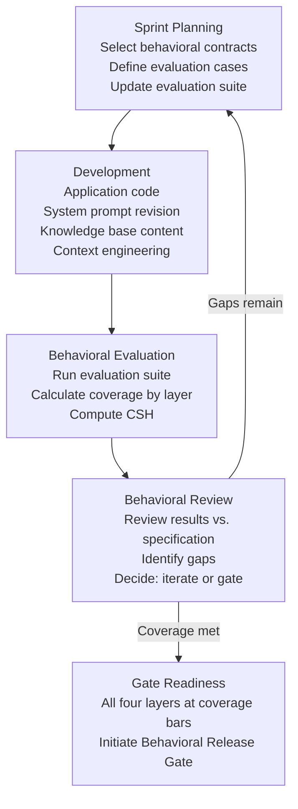

# APLC Stage 3 Inner Loop
## Sprint-Level Development Cycle for Agent Products Within Stage 3 Build & Evaluate

*APLC document. Specifies how the ASDLC inner loop (sprint-level agile development cycle) is interpreted for agent products within APLC Stage 3 (Build & Evaluate). This document resolves the structural gap where Stage 3 is bounded by the Behavioral Specification Gate and the Behavioral Release Gate but does not itself prescribe the iterative development cycle that operates within those bounds. Audience: engineering leads, behavioral specification analysts, evaluation team leads, and product owners governing Stage 3 execution.*

*Related documents: [[aplc.md]], [[agent-behavioral-evaluation.md]], [[agent-behavioral-specification.md]], [[agent-release-governance.md]], [[agent-composite-versioning.md]], ASDLC `asdlc.md`*

---

## The Gap: APLC Stage 3 and the Inner Loop

APLC Stage 3 is bounded at entry by the Behavioral Specification Gate (confirming that the behavioral specification is complete and loop-ready) and at exit by the Behavioral Release Gate (confirming that the behavioral evaluation portfolio is complete and the composite state is ready for production). The APLC defines what must be true before Stage 3 begins and what must be true before it ends. It does not prescribe the iterative cycle that operates within those bounds.

The ASDLC's engineering execution layer provides the manifesto's inner loop — the Specify → Design → Plan → Execute → Verify → Validate → Observe → Learn → Govern cycle — as the engineering execution mechanism for Stage 3. This loop is the technical development cycle. For software delivery, it is sufficient: a loop that completes its engineering cycle produces a verifiable artifact, and a verifiable artifact that passes the release gate is production-ready.

For agent products, engineering loop completion is necessary but not sufficient. An agent product that has passed all engineering evaluations (Layer 1) has verified that its deterministic components behave correctly. It has not demonstrated that its behavioral outputs meet the probabilistic assurance targets defined in the behavioral specification, that it withstands structured adversarial testing, or that human evaluators assess its quality as meeting specification targets. These three dimensions — behavioral coverage, adversarial robustness, and human-assessed quality — require iterative sprint-level work that the engineering loop does not govern.

The agent product inner loop defined in this document is the Stage 3 development cycle that governs this additional iterative work. It runs in parallel with the engineering loop. It does not replace it. The engineering loop governs the deterministic components; the agent product inner loop governs the behavioral evaluation portfolio that runs alongside and on top of those components. Stage 3 is complete only when both loops have reached their exit conditions.

A critical difference from software delivery: in software, "done" means the code does what the specification required. In agent product development, "done" means the Composite Agent State — all five components simultaneously — produces behavioral outputs that meet the probabilistic assurance targets in the behavioral specification, withstand adversarial evaluation at the required severity thresholds, and satisfy human evaluators on quality dimensions that automated evaluation cannot assess. This is a higher standard. It requires more iterations. Planning Stage 3 as if it were a software development phase will systematically underestimate both the duration and the evaluation investment required.

---

## Agent Product Inner Loop Cycle

The agent product inner loop operates at the sprint level within Stage 3. Each sprint is a governed iteration that produces specific artifacts and advances behavioral coverage. Sprints continue until behavioral coverage across all four evaluation layers meets the Behavioral Release Gate conditions.

### Sprint Planning

Sprint planning for an agent product sprint selects the behavioral contracts to be evaluated during the sprint and defines the evaluation cases for those contracts. This is not feature planning — it is evaluation portfolio planning. The backlog from which sprint items are drawn is the set of behavioral specification clauses not yet covered by the evaluation portfolio, ordered by priority (core use cases before edge cases; high-priority behavioral requirements before secondary constraints).

**Sprint planning produces:**
- A list of behavioral specification clauses targeted in this sprint, drawn from the use-case coverage map in [[agent-behavioral-specification.md]]
- Evaluation case definitions for each targeted clause: the input scenario, the expected behavior range, the evaluation method (automated or human), and the evaluation layer (Layer 1 through Layer 4)
- An updated evaluation suite incorporating the new evaluation cases
- A cost estimate for the evaluation runs planned for this sprint, validated against the evaluation budget

Sprint planning must not be collapsed into "we will continue building and run evaluations at the end." That is not sprint planning — it is unplanned development with retrospective evaluation. Retrospective evaluation discovers specification gaps after implementation, which is more expensive to resolve than gaps discovered before implementation.

### Development

The development phase implements or revises the non-model components of the Composite Agent State: application code, system prompt, knowledge base content, and context engineering configuration. The foundation model component is pinned during Stage 3 (see Foundation Model Pinning section below) and is not modified within the inner loop.

Development is driven by the evaluation gaps identified in the prior sprint's behavioral review — not by feature requests, not by demo preparation, and not by incremental enhancement of components the engineering team is comfortable with. The evaluation suite defines what is being built; development serves the evaluation.

Context engineering iteration is a first-class development activity (see Context Engineering Iteration section below). A system prompt change, a retrieval strategy adjustment, or a tool configuration change is a development action that changes the effective behavioral state of the Composite Agent State and requires re-evaluation. Treating context engineering as a peripheral activity — something to iterate informally between "real" development cycles — produces composite states whose actual behavioral properties are not known, because the most consequential changes to behavioral output were never formally evaluated.

### Behavioral Evaluation

At the end of each development phase, the evaluation suite runs against the current Composite Agent State. The evaluation covers all four layers, with emphasis on the layers and clauses targeted in this sprint's planning.

**Evaluation outputs per sprint:**
- Layer 1 pass/fail results for all engineering evaluations
- Layer 2 coverage measurement: which behavioral specification clauses now have automated evaluations, and whether the probabilistic assurance targets are being met
- Layer 3 adversarial findings: any new red-team results for the adversarial scenarios targeted in this sprint
- Layer 4 human preference scores for the interaction types evaluated by human evaluators in this sprint
- Composite State Hash for the evaluated configuration — computed over all five components of the current state

The CSH computation is not optional and is not deferred to the end of Stage 3. Every evaluated configuration has a CSH. The CSH is the identifier that links evaluation results to the specific composite state that produced them. An evaluation result without a CSH is not associated with any specific state; it cannot be used as behavioral baseline evidence at the Behavioral Release Gate.

### Behavioral Review

The behavioral review is a structured examination of this sprint's evaluation results against the behavioral specification. It is conducted by the evaluation team lead, the behavioral specification analyst, and the product owner. It is not an engineering status meeting; it is a governed review of behavioral evidence.

**The behavioral review determines:**
- Which targeted behavioral specification clauses now have sufficient evaluation coverage
- Which clauses have insufficient coverage and must be targeted in the next sprint
- Whether any evaluation results have identified specification gaps — cases where the specification is ambiguous, silent, or inconsistent with the observed behavioral evidence
- Whether any red-team findings require specification revision, evaluation suite update, or immediate remediation
- Whether the sprint produced a behavioral regression relative to prior sprint results (see Behavioral Regression Testing section below)
- Whether the overall evaluation coverage trajectory is on a path to Behavioral Release Gate readiness, or whether the sprint plan must be revised

**The behavioral review decides: iterate or gate.** If coverage across all four layers has not met the minimum bars defined for the Behavioral Release Gate, the loop returns to sprint planning with the identified gaps as the next sprint's primary input. If coverage has met all minimum bars and no blocking findings remain, the behavioral review recommends proceeding to the Behavioral Release Gate.

The decision to proceed to the Behavioral Release Gate belongs to the product owner — not to the engineering team and not to the evaluation team lead alone. The engineering team and evaluation team provide the evidence; the product owner decides whether the evidence is sufficient to release the composite state to production users.

### Gate Readiness

Gate readiness is not a phase — it is a state that the evaluation portfolio reaches when all Behavioral Release Gate conditions are satisfied. A Stage 3 team that is "preparing for the gate" by assembling documentation is executing the gate process, not preparing for it; gate readiness means the evidence is already complete, not that it is being compiled for submission.

The gate readiness check confirms:
- Layer 1: all engineering evaluations pass; engineering evidence bundle complete per manifesto P8
- Layer 2: 80% of core use cases have automated evaluations; 50% of edge cases have automated evaluations; held-out set included
- Layer 3: 100% of identified adversarial scenarios have red-team evaluations; no Critical or High findings outstanding; red-team report signed by red-team lead
- Layer 4: minimum 10% stratified sample of interaction types assessed by human evaluators; evaluator qualifications confirmed; rubric scores documented
- Behavioral baseline document established from the final sprint's evaluation results
- Composite State Manifest filed for the gate-submission composite state
- No behavioral regression from the prior sprint's evaluation results

When all conditions are met, the evaluation team lead files the Evaluation Clearance Report as defined in [[agent-behavioral-evaluation.md]] and the product owner initiates the Behavioral Release Gate review.

---

## Agentic Definition of Done

The manifesto's Definition of Done governs the engineering loop. For agent products in Stage 3, the Agentic Definition of Done extends the manifesto's DoD with behavioral evaluation conditions. Both must be satisfied for a sprint to be complete.

**A sprint is done for an agent product when all of the following conditions are true:**

| Condition | Source | Verification |
| --- | --- | --- |
| All behavioral contracts targeted in this sprint have at least one evaluation case | Sprint planning artifacts | Evaluation suite coverage map |
| Evaluation coverage meets the minimum threshold for each targeted contract | Behavioral specification coverage targets | Layer 2 coverage report |
| No open Critical red-team findings from Layer 3 evaluation | Red-team protocol | Red-team findings log |
| CSH computed and recorded for the current Composite Agent State | Composite versioning requirement | CSH snapshot in sprint evaluation report |
| No behavioral regression from prior sprint | Regression testing requirement | Regression test report |
| Engineering DoD conditions met per manifesto P8 | Manifesto P8 | Engineering evidence bundle |

**"No open Critical red-team findings"** means that every Critical finding identified in this sprint's Layer 3 evaluation has been remediated and re-tested before the sprint closes. A Critical finding that is acknowledged and deferred to the next sprint is not a closed sprint — it is a sprint with an unresolved blocking finding that blocks both sprint completion and eventual gate clearance.

**"No behavioral regression"** means that the prior sprint's evaluation results have been re-run against the current composite state, and all metrics from the prior sprint are maintained or improved. A sprint that improves coverage on new behavioral contracts but degrades coverage on previously covered contracts has not made progress — it has shifted a gap, not closed one.

The Agentic Definition of Done is stricter than the manifesto's DoD in one important dimension: it requires behavioral evaluation evidence for every sprint, not only at the end of Stage 3. An agent product development process that defers all behavioral evaluation to the final sprint before the gate is not operating an inner loop — it is operating a waterfall with a behavioral evaluation phase at the end. This is precisely the pattern the inner loop is designed to prevent: behavioral evaluation gaps discovered at the end of Stage 3 are expensive and schedule-threatening. Behavioral evaluation gaps discovered at the end of each sprint are cheap and schedule-recoverable.

---

## Behavioral Regression Testing

Every sprint in Stage 3 runs the full evaluation suite from prior sprints before presenting new evaluation results. This is not optional and is not conditioned on whether "anything changed" in the engineering sense. In agent products, behavioral regression can occur without code changes: a system prompt revision that improves behavior on one input class can degrade behavior on another; a knowledge base addition that fills a coverage gap can alter retrieval patterns in ways that affect previously covered cases; a model pin that is confirmed stable at one stage of development may behave differently as context engineering evolves.

**Regression testing in the inner loop:**

The regression test suite is the union of all evaluation cases from all prior sprints. At each sprint, the full regression suite runs before new evaluation cases are added. If any regression test fails:
- The sprint is blocked: new evaluation results cannot be presented to the behavioral review until the regression is understood and addressed
- The behavioral review examines the regression finding: is it a genuine behavioral regression, or is the evaluation case itself outdated (because the behavioral specification was legitimately revised)?
- If genuine regression: the development phase returns to address the root cause before the sprint closes
- If evaluation case obsolescence: the evaluation case is revised through the governed specification revision process, not silently updated

**Regression budget:** The behavioral specification defines an acceptable regression rate — the fraction of prior evaluation cases that may fail before a regression is considered blocking. The default is zero: any regression failure blocks the sprint. For mature evaluation portfolios with known flaky evaluations (evaluations whose probabilistic pass rate is below 95%), a regression budget may be defined at Stage 2 that allows a small number of known-flaky cases to fail without blocking the sprint, provided those cases are documented as flaky and are being actively improved. The regression budget is not a license to ignore regressions — it is a precision tool for managing known evaluation quality limitations without being blocked by them.

**Regression testing and CSH.** Regression results are linked to the CSH of the evaluated state. A regression finding links: the evaluation case identifier, the prior sprint CSH at which the evaluation passed, the current sprint CSH at which it failed, and the behavioral specification clause to which the evaluation traces. This traceability enables the Technical Owner to use composite versioning to identify which component change introduced the regression.

---

## Context Engineering Iteration

Context engineering — the design of the system prompt, tool selection and configuration, retrieval strategy, and context assembly logic — is manifesto P7's domain. In the Stage 3 inner loop, context engineering iteration is a development activity that carries the same evaluation obligation as any other development activity.

**Why context engineering iteration requires re-evaluation.** The Composite Agent State includes the system prompt as one of its five components. A system prompt change changes the CSH. A new CSH means a different behavioral identity. The behavioral evaluation results associated with the prior CSH are not evidence of the new configuration's behavioral quality — they are evidence of the prior configuration's behavioral quality. The evaluation suite must re-run against the new CSH.

This has an important practical implication: teams that iterate on the system prompt frequently during Stage 3 will run more evaluation cycles. This is the correct behavior, not an inefficiency. Each context engineering iteration is a hypothesis about how to better achieve the behavioral specification targets; the evaluation suite is the mechanism for testing that hypothesis. Teams that avoid re-evaluation after context engineering changes are accumulating behavioral debt — they are building a system whose behavioral properties are less well understood with each unevaluated change.

**Context engineering changes in the sprint cycle.** Context engineering changes are development-phase activities. They trigger a full behavioral evaluation run in the evaluation phase, the same as any other development change. A sprint that includes both a context engineering change and a knowledge base update must evaluate both changes in combination — the composite state evaluated is always the full composite state, not individual components.

**Context engineering and the token budget.** Every context engineering change must be checked against the token budget defined in Stage 2. A system prompt extension that improves behavioral quality while exceeding the token budget creates a cost specification conflict that must be resolved through a governed Stage 2 cost envelope revision, not by informally accepting the budget overrun.

---

## Foundation Model Pinning During Stage 3

During Stage 3, the foundation model component of the Composite Agent State must be pinned to a specific version. "Pinned" means the model version identifier is explicitly locked in the composite state configuration and cannot change through automatic update, provider-initiated rollout, or team configuration change without a gate-level review.

**Why foundation model pinning is required.** The behavioral evaluation portfolio is built against a specific composite state. If the foundation model can change during Stage 3 — even if the change is a provider's routine quality improvement — the evaluation results accumulated before the change are not evidence of the post-change state's behavioral quality. The Behavioral Release Gate requires that the evaluation portfolio was conducted against the composite state being released. A model update during Stage 3 without a controlled gate process invalidates that guarantee.

**Model updates during Stage 3 require gate-level review.** If a foundation model provider releases a new version during Stage 3 that the team believes will improve behavioral quality, accepting that update is not an inner loop decision — it is a gate-level decision:

1. The evaluation team runs a targeted assessment of the new model version against the current evaluation suite
2. The assessment results are reviewed at a behavioral review with the product owner's participation
3. If the new model version is accepted: the composite state is updated, a new CSH is computed, and the Stage 3 inner loop restarts from the current sprint with the new model pinned; evaluation results accumulated against the old model version are treated as regression test baselines but not as gate evidence for the new state
4. If the new model version is not accepted: the prior version remains pinned and the Stage 3 inner loop continues against the prior version's evaluation baseline

A model update accepted without this review process is a governance failure: the team is releasing a composite state that includes a component they have not evaluated under the required protocol.

**Model pinning and the Composite State Manifest.** The pinned model version is recorded in the Composite State Manifest. At the Behavioral Release Gate, the manifest must show a single pinned model version for the entire Stage 3 evaluation period, or a documented gate-level review for each model version change that occurred during Stage 3.

---

## Evaluation Coverage Ramp

Stage 3 evaluation coverage does not reach its minimum bars in the first sprint. It grows through a defined ramp that prioritises the most important behavioral contracts first and progressively expands to edge cases and adversarial scenarios.

**Coverage ramp structure:**

| Sprint Range | Coverage Priority | Target at End of Range |
| --- | --- | --- |
| Early sprints (first third of Stage 3) | Core use cases from the use-case coverage map; Layer 1 engineering evaluations; happy-path Layer 2 behavioral contracts | Layer 1 complete; Layer 2 core use case coverage at 80% |
| Mid sprints (middle third of Stage 3) | Edge cases; boundary cases; adversarial scenarios from the red-team scope; human evaluation of representative samples | Layer 2 edge case coverage at 50%; Layer 3 adversarial categories initiated; Layer 4 initial human evaluation sample |
| Late sprints (final third of Stage 3) | Held-out set evaluation; remaining adversarial scenarios; adversarial human evaluation sample; regression hardening | All four layers at Behavioral Release Gate minimum coverage bars |

The ramp is not rigid — some products will reach gate readiness faster and others more slowly depending on behavioral complexity and specification completeness. The ramp structure is a planning guide, not a schedule commitment. What the ramp structure guarantees is that coverage grows progressively and that the most important behavioral contracts are validated earliest, so that specification gaps discovered in core use case evaluation are discovered early enough to be resolved without compressing the gate timeline.

**Coverage gaps in late sprints.** A coverage gap discovered in the final sprint — a core use case not evaluated, an adversarial category with no red-team results — is a Stage 3 planning failure, not a normal finding. Core use case evaluation gaps in the final sprint indicate that sprint planning did not prioritise core cases in early sprints. Adversarial category gaps in the final sprint indicate that red-team planning was deferred. Both patterns require a sprint planning retrospective, not just a remediation action: the planning process that allowed important coverage work to be deferred until the last sprint must be corrected so that the same pattern does not repeat in the next Stage 3 cycle.

---

## Inner Loop Governance Artifacts

Each inner loop sprint produces a defined set of governance artifacts. These artifacts accumulate over the course of Stage 3 and together constitute the behavioral evaluation portfolio submitted to the Behavioral Release Gate.

| Artifact | Content | Owner |
| --- | --- | --- |
| Sprint evaluation report | Layer 1–4 results for this sprint; comparison to prior sprint results; coverage delta | Evaluation team lead |
| CSH snapshot | Composite State Hash for the evaluated configuration; component version identifiers for all five components | Technical Owner |
| Coverage delta report | Which behavioral specification clauses gained evaluation coverage in this sprint; updated coverage percentage by layer and category | Evaluation team lead |
| Regression test report | Results of the full prior evaluation suite run against the current CSH; regression findings with root cause; regression budget status | Evaluation team lead |

All four artifacts are filed to the Agentic Governed Knowledge Base (AGKB) at the end of each sprint. Filing is not optional and is not deferred to the end of Stage 3. The AGKB is the audit trail for Stage 3 governance; sprint artifacts not filed to the AGKB at the time of production cannot be verified as contemporaneous with the sprint that produced them.

The sprint evaluation report carries the *human-authored* or *agent-proposed-with-human-review* epistemic tier label depending on whether it was drafted manually or with governance agent assistance. For the behavioral review section of the sprint evaluation report, the *agent-proposed-with-human-review* label requires the evaluation team lead as the named reviewer, with the review date recorded. The CSH snapshot carries the *tool-generated* label: it is computed deterministically from the component version identifiers and carries no agent-generated content.

---

## Handoff to Stage 4

Stage 3 exits to the Behavioral Release Gate. The gate is not an event — it is a process that begins with the filing of the Evaluation Clearance Report and ends with the product owner's gate approval. The evaluation clearance report is the complete behavioral evidence package submitted to the gate reviewer.

**Exit criteria from Stage 3 inner loop:**

The following conditions must all be true before the evaluation team lead files the Evaluation Clearance Report:

1. All inner loop sprint artifacts for every sprint in Stage 3 are filed to the AGKB
2. The Agentic Definition of Done is satisfied for the final sprint: no open Critical red-team findings; no behavioral regression; CSH computed for the gate-submission state
3. The evaluation portfolio meets all four-layer minimum coverage bars (as specified in [[agent-behavioral-evaluation.md]]): Layer 1 all P8 evaluations pass; Layer 2 80% core use case coverage, 50% edge case coverage, held-out set included; Layer 3 100% adversarial scenario coverage, no Critical or High findings outstanding; Layer 4 10% stratified human evaluation sample with qualified evaluators
4. Behavioral baseline document established from the final sprint's evaluation results; the baseline is the quantitative behavioral profile at gate time
5. Composite State Manifest filed for the gate-submission composite state, with pinned model version confirmed
6. Control state record complete with all controls in terminal states (pass, waived-with-current-waiver, or deferred-to-gate with documented rationale) — no controls in stale or requires-human-decision status
7. All epistemic tier labels applied to gate artifacts; no findings sections carrying the *agent-generated* label without named human review

**The full evaluation package submitted to the Behavioral Release Gate must contain:**

- The Evaluation Clearance Report (signed by the named evaluation team lead)
- The complete sprint artifact set from AGKB (all sprint evaluation reports, CSH snapshots, coverage delta reports, regression test reports)
- The red-team report (signed by the red-team lead)
- The behavioral baseline document
- The Composite State Manifest for the gate-submission state
- The control state record
- The Stage 3 cost report: total evaluation cost incurred vs. evaluation budget; per-sprint cost breakdown; final cost-per-interaction measurement for the gate-submission state

The Stage 3 cost report is filed alongside the behavioral evidence package because the Behavioral Release Gate includes FinOps conditions (per [[agent-finops-governance.md]]): the gate-submission state must be within cost envelope tolerance, and the evaluation budget utilisation must be documented.

**What the product owner reviews at the gate.** The product owner does not review the sprint artifact set for individual sprint completeness — that is the evaluation team lead's accountability. The product owner reviews the Evaluation Clearance Report and the behavioral baseline document, which summarise the portfolio evidence. The product owner's decision is: is the behavioral evidence in this clearance report sufficient to release this composite state to production users? That is a product decision, not a technical decision. The product owner accepts production accountability for the gate approval; the evaluation team lead accepts accountability for the accuracy of the evidence the report contains.

---

*Cross-references: [[aplc.md]] for the full APLC lifecycle and gate definitions; [[agent-behavioral-evaluation.md]] for the four-layer evaluation portfolio and minimum coverage bars that the inner loop's evaluation phase must satisfy; [[agent-behavioral-specification.md]] for the behavioral specification that drives sprint planning and evaluation case design; [[agent-release-governance.md]] for the Behavioral Release Gate conditions and the gate process that Stage 3 exits into; [[agent-composite-versioning.md]] for the CSH computation, Composite State Manifest format, and AGKB filing requirements; [[agent-finops-governance.md]] for the cost envelope discipline, evaluation cost budget, and FinOps gate conditions that govern Stage 3 economics. ASDLC reference: ASDLC `asdlc.md` for the engineering execution inner loop (manifesto Specify→Govern cycle) that Stage 3 incorporates as its engineering foundation.*
