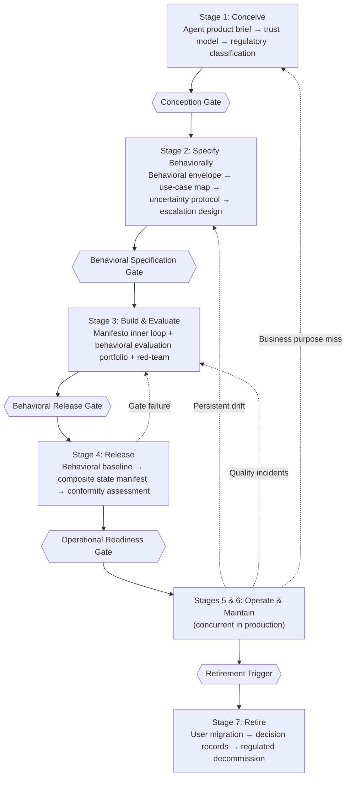

# Agentic Product Lifecycle — Overview

*Architecture document. Audience: product owners, business sponsors, risk officers, enterprise architects considering agent product deployment. This document describes what the APLC is, why it exists, and how it is structured. For implementation guidance, see `aplc-guide.md`.*

---

## What the APLC Is and Is Not

The Agentic Product Lifecycle (APLC) governs **agent products**: systems where an AI agent is the deliverable, not an instrument of delivery. An agent product is something a user or customer interacts with directly — a claims processing agent, a financial advisory agent, a customer support agent, an internal decision-support tool — where the agent's behavioral characteristics define the product's value, risk, and accountability.

This distinction matters because it changes every governance requirement downstream.

**The APLC is not the Manifesto.** The manifesto (`manifesto.md`) governs engineering execution: how agentic engineering teams specify, build, verify, validate, observe, and govern within the inner loop of a development sprint. The manifesto applies to Stage 3 of the APLC, wholesale. It is the engineering execution engine. But the manifesto does not address what comes before engineering (product conception, behavioral specification, trust architecture, regulatory classification) or after deployment (behavioral drift detection, foundation model update governance, human-in-the-loop management at scale, regulated retirement). The APLC provides the lifecycle framework in which the manifesto's inner loop operates.

**The APLC is not the ASDLC.** The Agentic Software Delivery Lifecycle governs software delivery: requirements, development, testing, integration, release, operations, and maintenance of software systems. The APLC governs agent product delivery. An organisation may use both simultaneously — the ASDLC for the infrastructure and platform that hosts the agent, the APLC for the agent product itself. They share the manifesto as the engineering execution mechanism but diverge everywhere else. The ASDLC's release governance, operations governance, and maintenance governance are all referenced in APLC stages, extended rather than replaced.

**The APLC is not an AI ethics framework.** AI ethics frameworks articulate values — fairness, transparency, accountability, human oversight. Those values are correct. But values without lifecycle governance do not change what teams build. The APLC does not debate values; it operationalises them as stage gate conditions, evaluation requirements, and release criteria. When the APLC requires a fairness metric in the behavioral evaluation portfolio, that is not an ethics exercise — it is a release condition.

**The APLC is not an AI model governance framework.** Model governance frameworks govern model development: training data, fine-tuning, bias evaluation, model cards, model versioning. The APLC governs deployed agent products that use models as components. The distinction is consequential: a model governance framework asks "is this model safe to release?" The APLC asks "is this agent product safe to deploy to users, and how do we govern it through its operational life and into retirement?"

---

## The Paradigm Shift

Deploying an agent product is not deploying software. The governance requirements differ at every dimension.

| Dimension | ASDLC (software delivery) | APLC (agent product delivery) |
| --- | --- | --- |
| What you specify | Functional acceptance criteria | Behavioral envelope, persona, uncertainty protocol |
| What you test | Deterministic pass/fail | Probabilistic behavioral coverage + red-teaming |
| What you deploy | A fixed software artifact | A composite system (code + model + prompt + knowledge + memory) |
| What drifts | Nothing (code doesn't change itself) | Everything (model updates, memory accumulation, knowledge staleness) |
| What you monitor | Service health (latency, availability) | Behavioral quality (output quality rate, envelope compliance, drift) |
| What incidents look like | Crashes, outages, bugs | Hallucinations, persona breaks, adversarial manipulation |
| What "version" means | A single artifact version | A composite state hash across five components |
| Regulatory exposure | Process-level (how we built it) | Product-level (what it is and what it does) |

The inversion — from software artifact to behaving system — changes every governance requirement downstream. Software has a version; you can precisely describe what it does by reading its code. An agent product has a composite behavioral state: the same application code behaves differently depending on the foundation model version, the system prompt, the knowledge base state, and the accumulated memory. A model provider update that no engineer on your team initiated can change the behavioral profile of your deployed product. Memory accumulation across thousands of interactions can shift the agent's behavior in ways that no single interaction reveals. This is not a complication to be managed; it is the fundamental characteristic of the system that the APLC is designed to govern.

---

## APLC Values

The APLC's five product-level values govern agent product decisions from conception through retirement.

| We Value More | over | We Also Value |
| --- | --- | --- |
| Behavioral integrity over deployment velocity | over | Shipping before behavior is understood |
| Measured behavioral coverage over assumed correctness | over | "The demo worked" as proof of readiness |
| Governed behavioral drift over passive monitoring | over | Detecting drift after user harm has occurred |
| Explicit trust architecture over implicit defaults | over | Agents that do what any instruction says |
| Regulated retirement over silent abandonment | over | Agents that outlive their governance |

**Behavioral integrity over deployment velocity.** An agent product whose behavioral characteristics are not understood before deployment is not a product — it is an experiment conducted on users. Understanding behavior before deployment requires specification, evaluation, and red-teaming; no amount of deployment velocity recovers trust destroyed by an uncontrolled behavioral failure.

**Measured behavioral coverage over assumed correctness.** "The demo worked" confirms that the developer's anticipated use case produces an acceptable output in a controlled context. It is not evidence of behavioral quality across the actual user population. Behavioral coverage means evaluating across the full use-case distribution — core cases, edge cases, boundary cases, and adversarial inputs — with a sampling methodology that is specified before evaluation begins.

**Governed behavioral drift over passive monitoring.** Behavioral drift — the agent's behavior changing not because of an intentional update but because of a model version change, knowledge base staleness, or memory accumulation — is not detectable by alerting that it has already caused harm. It requires a behavioral baseline established at release, deviation thresholds specified in advance, and a response protocol that activates before drift crosses into incident.

**Explicit trust architecture over implicit defaults.** An agent that responds to any instruction from any source is not governed — it is a vulnerability. The trust architecture specifies who can instruct the agent, at what authority level, through what channels, and with what limits. Implicit defaults mean the model provider's defaults, which may be appropriate for general use and inappropriate for the specific deployment context.

**Regulated retirement over silent abandonment.** An agent product that is simply switched off when it is no longer needed leaves users without migration, destroys accountability records, and may violate regulatory retention requirements. Retirement is a governed stage, not an absence of activity.

The manifesto's six engineering execution values — iterative steering and alignment, verified outcomes with auditable evidence, right-sized agent collaboration, curated high-signal context and memory, tooling and observability, resilience under stress — are inherited for Stage 3 (Build and Evaluate). They are not repeated here because they govern engineering execution, not product lifecycle governance. Both sets apply simultaneously within Stage 3.

---

## The Seven-Stage Model

### Stage 1 — Conceive

Stage 1 produces the Agent Product Brief: a governed document that establishes what the agent is, who it serves, what authority it has, and what success looks like. It includes the trust architecture design (principal hierarchy, permission model, conflict resolution), the persona design, and the EU AI Act regulatory classification. Nothing in Stage 2 can be correctly specified without a complete Stage 1 — every behavioral requirement traces back to a decision made here. Full specification: `agent-conception.md`.

**Conception Gate conditions:** business purpose validated with evidence; success criteria measurable (metric, target, measurement method, baseline all specified); trust architecture complete at all three tiers; persona design coherent with behavioral scope; regulatory classification completed with legal review; accountable human named; out-of-scope statements specific and complete.

### Stage 2 — Specify Behaviorally

Stage 2 translates the product brief into the behavioral specification: the authoritative product-level contract that engineers implement and evaluators test. It specifies the four-layer behavioral envelope (hard boundaries, soft boundaries, performance targets, adaptation scope), the use-case coverage map (core, edge, boundary, out-of-scope, and adversarial zones), the uncertainty protocol, and the escalation design. The behavioral specification is the single source from which evaluation cases, compliance documentation, and operational monitoring specifications are derived. Full specification: `agent-behavioral-specification.md`.

**Behavioral Specification Gate conditions:** behavioral envelope complete at all four layers with enforcement mechanisms specified; use-case coverage map reviewed by a domain expert not involved in authoring; uncertainty protocol operationally specified with thresholds and language; escalation design reviewed and approved by product owner and risk stakeholders; safety and alignment requirements traceable to Stage 1; single-source integrity confirmed.

### Stage 3 — Build and Evaluate

Stage 3 runs the manifesto's full engineering inner loop (Specify → Govern cycle) to produce the deployable artifact, and simultaneously executes the four-layer behavioral evaluation portfolio. The portfolio comprises: Layer 1 engineering evaluations (P8 deterministic suite), Layer 2 behavioral coverage evaluations (probabilistic assurance targets), Layer 3 adversarial evaluations (structured red-team against six attack categories), and Layer 4 human preference evaluations (quality dimensions requiring judgment). All four layers must be complete before the Behavioral Release Gate. Full specification: `agent-behavioral-evaluation.md`.

**Behavioral Release Gate conditions:** engineering DoD met per manifesto P8; behavioral evaluation portfolio complete at all four layers with minimum coverage bars satisfied; no Critical or High red-team findings outstanding; behavioral baseline document established; composite state manifest filed; named evaluation team lead sign-off.

### Stage 4 — Release

Stage 4 is the governance transition from built-and-evaluated agent to deployed product. It does not replace the ASDLC release gate — it extends it with seven agent-specific conditions: engineering DoD met, behavioral evaluation portfolio complete, behavioral baseline document established, composite state manifest filed, EU AI Act conformity documentation complete (for high-risk systems), named accountable human with documented scope of accountability, and user-facing transparency infrastructure live and verified. For significant user bases, a canary deployment is required before full rollout. Full specification: `agent-release-governance.md`.

**Operational Readiness Gate conditions:** all seven behavioral release gate conditions satisfied; canary deployment completed with no rollback triggers activated; product owner explicit approval to proceed to full rollout; behavioral monitoring infrastructure live in production environment.

### Stages 5 and 6 — Operate and Maintain

Stages 5 (Operate) and 6 (Maintain) run concurrently from deployment until the retirement trigger fires. Stage 5 governs behavioral observability in production: output quality rate, behavioral envelope compliance rate, task success rate, escalation rate, drift indicators, user experience signals, safety signals, human-in-the-loop queue management, and agent incident management across five incident classes (quality, behavioral, safety, persona, adversarial). Stage 6 governs planned behavioral maintenance: recalibration cycles, foundation model update governance, knowledge base refresh, and memory governance. Full specifications: `agent-operations.md` and `agent-maintenance.md`.

**Retirement Trigger conditions** (any one sufficient): behavioral quality cannot be restored to specification despite recalibration; business purpose no longer achievable or relevant; regulatory classification change requiring capabilities the current architecture cannot support; foundation model changes incompatible with the behavioral specification; accountable human formally declares product end-of-life.

### Stage 7 — Retire

Stage 7 is the governed decommission of the agent product. It includes user migration planning (users transitioned to alternative services or informed of discontinuation), decision record preservation (all APLC stage gate records retained per regulatory requirements), composite state manifest archive, and regulated decommission confirmation. For EU high-risk AI systems, technical documentation must be retained for ten years after market placement. Silent abandonment — switching off the agent without migration, retention, or regulatory notification — is a governance failure, not an operational convenience. Full specification: `agent-retirement.md`.

### Feedback Loops

**Persistent drift → Stage 2.** When Stage 5 monitoring reveals that behavioral drift cannot be resolved by Stage 6 recalibration and requires a fundamental revision to the behavioral specification, the lifecycle returns to Stage 2. The revised specification must then flow through Stage 3 evaluation and Stage 4 release governance before production deployment.

**Quality incidents → Stage 3.** When Stage 5 incident management identifies a class of quality failure not covered by the existing evaluation portfolio, the lifecycle returns to Stage 3 to update the evaluation portfolio and revalidate. The update addresses the evaluation gap without requiring a full Stage 2 revision unless the incident reveals a specification gap.

**Business purpose miss → Stage 1.** When Stage 5 trust management signals sustained trust degradation with no recovery trend, or when Stage 6 maintenance reveals that the agent's business purpose is no longer achievable in its current form, the lifecycle returns to Stage 1 for a business case review. This may result in a major specification revision, a change in deployment scope, or a retirement decision.

**Gate failure → Stage 3.** When a Stage 4 gate condition fails — typically an outstanding red-team finding, a behavioral baseline gap, or an EU AI Act conformity documentation shortfall — the product returns to Stage 3 for targeted remediation before resubmitting to the Stage 4 gate.

**What "loop closed" means architecturally.** A feedback signal is not closed when a corrective action is deployed. It is closed when two conditions are both met: first, the governing artefact for the stage that originated the gap has been updated to reflect the learning (the behavioral specification, the evaluation portfolio, or the product brief, depending on which stage originated the gap); and second, the downstream stages have re-verified against the updated artefact. A quality incident that produces a hotfix without an evaluation portfolio update has not closed the loop — it has patched the symptom while leaving the evaluation gap open. A behavioral drift event that produces a recalibration without a behavioral specification update has not closed the loop — the specification still describes the pre-drift envelope, and the next release gate will evaluate against a specification that no longer matches the agent's intended operational profile. Deferred closure accumulates as governance debt: the gap between what the governing artefacts say and what the production system does. That debt surfaces at regulated examination as an inability to demonstrate that the governance artefacts reflect the actual governed state of the agent product.

---

## The Six New Concepts

These concepts have no direct analog in software delivery governance. Each one represents a governance requirement that the APLC introduces because agent products require it.

### 1. Composite Agent State

An agent product's behavioral identity is not determined by its application code alone. It is determined by five components simultaneously: application code (commit hash), system prompt (version label and content hash), foundation model (provider, model name, snapshot version where available), knowledge base (snapshot ID, document count, source manifest hash), and memory state (content hash or stateless designation). The Composite State Hash (CSH) is computed as a hash over all five component identifiers. When any component changes — including a model update initiated by the provider without the engineering team's action — the CSH changes, the behavioral identity of the product changes, and a new composite state manifest must be filed. The CSH is the reference for incident investigation: every production interaction is associated with the CSH active at the time, so a behavioral deviation can be traced to which component changed and when. Full specification: `agent-composite-versioning.md`.

### 2. Behavioral Drift

Behavioral drift is a change in the agent's behavioral profile not caused by an intentional update by the engineering team. Sources include: foundation model updates by the provider that shift output characteristics; memory accumulation across interactions that gradually adjusts the agent's responses; knowledge base staleness that causes the agent's responses to diverge from current reality; and input distribution shift that brings the production population outside the specification-time training distribution. Drift is measured against the behavioral baseline established at Stage 4 release — not against the prior measurement window, which masks slow continuous drift. Drift within the behavioral specification (the agent's behavior has changed but remains within all four layers of the envelope) is a monitoring finding requiring Stage 6 attention. Drift outside the behavioral specification is an incident requiring immediate response per Stage 5 incident management. The critical distinction: drift is not a failure of engineering execution; it is a structural property of composite systems, and governing it is a product lifecycle obligation.

### 3. Foundation Model Update Governance

The foundation model is the one composite state component the engineering team does not directly control. Model providers update their models — for performance improvements, safety improvements, policy compliance, or capability expansions — without necessarily providing advance notice that the update will change the behavioral profile of agent products built on those models. Foundation model update governance is the process by which these provider-initiated changes are detected, tested, and accepted or rejected. Detection requires monitoring the CSH in production: when the CSH changes without an engineering-initiated deployment, a model update or configuration drift has occurred. Testing requires running the behavioral evaluation portfolio — at minimum Layer 2 and Layer 3 — against the new model version before accepting it into production. Acceptance or rejection is a product decision made by the named accountable human, not an automatic rollover. Full specification: `agent-maintenance.md`.

### 4. Red-Team Protocol

Red-teaming for an agent product is not exploratory testing or user acceptance testing. It is a structured adversarial exercise conducted before every behavioral release gate — not periodically, not for high-risk products only, but before every release, because every composite state change can change the agent's adversarial robustness profile. The red-team protocol requires a defined scope and threat model, coverage of six mandatory attack categories (prompt injection, principal impersonation, persona break, behavioral envelope violation, information extraction, social engineering), findings classified by severity (Critical, High, Medium, Low) with defined release consequences (Critical findings block release without exception), and a mandatory red-team report signed by the red-team lead. Critical and High findings must be remediated and re-tested before release clearance. The team composition requires at minimum three roles: an independent adversarial tester (who did not build the system), a domain expert, and a safety-focused evaluator. Full specification: `agent-behavioral-evaluation.md`.

### 5. Human Evaluation Workflow

Automated evaluations measure what they can quantify. Human evaluators assess what requires judgment. For four quality dimensions — output preference quality, tone and persona consistency, complex judgment cases, and safety review of flagged interactions — human evaluation is not a supplement to automated evaluation; it is the only valid measurement method. The human evaluation workflow requires a defined sampling methodology (stratified sample as the baseline, adversarial sample of flagged interactions as the supplement), an anchored rubric approved by the product owner before evaluation begins, and evaluators who have both domain expertise and familiarity with the behavioral specification. For agents in regulated domains, domain expert evaluators are not optional. Evaluator qualification is a gate condition, not a best practice. The workflow produces findings that feed back to the behavioral specification, the evaluation portfolio, and the behavioral baseline in production. Full specification: `agent-behavioral-evaluation.md`.

### 6. Agent Incident Classification

Agent products experience five classes of incident, all of which supplement rather than replace the infrastructure and application incident classes from software operations. **Quality incidents**: the agent is available and responding within latency targets, but output quality has fallen below the quality SLO — responses are less accurate, less helpful, or less aligned with user expectations. **Behavioral incidents**: the agent is operating outside its behavioral specification — violating hard boundaries, exceeding soft boundary configurations, or failing performance targets consistently. **Safety incidents**: the agent has caused harm or a credible assessment determines harm is likely — harmful content produced, safety escalation failure, privacy violation. **Persona incidents**: the agent has broken character — adopted a different identity, provided responses inconsistent with the designed persona, or denied being an AI when directly asked. **Adversarial incidents**: confirmed malicious manipulation — a successful prompt injection, jailbreak, principal impersonation attack, or goal hijacking that produced an out-of-spec output or extracted restricted information. Each class has a distinct detection methodology, escalation path, response protocol, and regulatory notification assessment. Treating all five as "bugs" produces the wrong response to four of them.

---

## How to Adopt the APLC

The APLC is not all-or-nothing. The guide (`aplc-guide.md`) defines minimum viable governance at each stage and a maturity progression. Three starting points address the most common adoption scenarios.

### Starting Point 1: Greenfield Agent Product

Start at Stage 1. Run the full lifecycle. Stage 1's Conception Gate is the lightest of all the gates — its conditions are evidence of thinking, not evidence of building. A product team that cannot satisfy the Conception Gate conditions (validated business purpose, measurable success criteria, trust architecture, persona design, regulatory classification, accountable human, out-of-scope statements) is not ready to begin engineering, regardless of whether the APLC exists. The gate makes that visible rather than embedding unresolved questions into the engineering phase where they become expensive to unwind.

### Starting Point 2: Agent Already Deployed Without APLC Governance

Start at Stage 5. Begin by establishing a behavioral baseline retrospectively: measure the deployed agent's behavioral characteristics now — output quality rate, behavioral envelope compliance rate, task success rate, escalation rate — and record them as the operational baseline. Then work backward: derive a behavioral specification from observed behavior (what the agent demonstrably does and does not do), conduct a retrospective red-team exercise, and file a composite state manifest for the current deployment state. This backward path does not substitute for forward-path governance — it creates the foundation from which forward governance can proceed. The retrospective baseline will have gaps that a properly conducted Stage 1–3 would not; document those gaps explicitly and close them in the next planned release cycle.

### Starting Point 3: Regulated Industry Deployment

Start at `agent-regulatory-classification.md`. Determine the EU AI Act risk class before any other APLC activity. For high-risk systems under Annex III, the conformity requirements are not a Stage 4 documentation exercise — they are design constraints from conception onward. An agent product that is designed, specified, built, and evaluated before its conformity requirements are understood will not satisfy those requirements at Stage 4 without retroactive rework that may be architecturally disruptive. The classification determines which stage gate conditions are mandatory, which evaluation requirements are elevated, and what documentation must be maintained throughout the lifecycle. Regulatory classification is the governance foundation; everything else is built on it.

---

## Relationship to the Manifesto and ASDLC

The manifesto is the engineering execution engine for Stage 3 of the APLC. Stage 3 runs the manifesto's full Specify → Govern cycle — every principle applies, every constraint holds, the Definition of Done is unchanged. The manifesto's P8 (Evaluations are the contract) is the foundation of the APLC's Layer 1 behavioral evaluation. The manifesto's P9 (Observability is accountability) is the foundation of Stage 5 behavioral observability. The manifesto's P12 (A named human is accountable) is carried through every APLC stage gate from Conception to Retirement. The manifesto does not need to be modified to work within the APLC; it needs to be understood as operating within a lifecycle that precedes and follows it.

The ASDLC governs software delivery. The APLC governs agent product delivery. An organisation using the ASDLC for its software delivery pipeline and the APLC for its agent products is not running two competing frameworks — it is applying the right framework at the right level of the system. The infrastructure, platform, and supporting software that hosts the agent is governed by the ASDLC. The agent product itself is governed by the APLC. Both reference the manifesto as the engineering execution standard. In practice, the APLC's Stage 4 extends the ASDLC's release governance rather than replacing it; Stage 5 extends the ASDLC's operations governance; Stage 6 extends the ASDLC's maintenance governance. The extension pattern is consistent: the ASDLC governs the service; the APLC governs the behavior of the agent that the service hosts.

Throughout this document, "extends" has a precise meaning: the ASDLC conditions are required and the APLC adds additional conditions on top of them. The APLC does not replace or absorb the ASDLC. An agent product that satisfies only the APLC's conditions without satisfying the ASDLC's underlying conditions is not governed at Stage 4, 5, or 6 — it has met the behavioral layer while leaving the infrastructure and service delivery layer ungoverned.

### Gate Integration: How APLC and ASDLC Gate Sets Combine

**Stage 4 — combined gate record.** The APLC's Behavioral Release Gate and the ASDLC's Release Gate are not two parallel records. An organisation running both frameworks must produce one combined gate record per deployment that satisfies all conditions from both gates. The APLC's Behavioral Release Gate conditions are the agent-product-specific extension of the ASDLC's Release Gate. APLC Condition 1 (engineering DoD met per manifesto P8) directly satisfies ASDLC Release Gate Condition 1 (evidence bundle complete) — the P8 evidence bundle is the engineering evidence required by both gates. APLC behavioral conditions 2–7 (behavioral evaluation portfolio complete, no outstanding Critical or High red-team findings, behavioral baseline established, composite state manifest filed, EU AI Act conformity documentation complete, named accountable human with documented scope) are APLC-exclusive additions that the ASDLC Release Gate does not address and that the combined gate record must include in full.

**Stage 5 — ASDLC operational readiness as prerequisite.** The ASDLC's Operational Readiness Gate conditions — runbook complete and accessible, SLOs defined and instrumented, on-call coverage assigned, system steward named, security scan current, license compliance verified, trace retention policy active — are prerequisites for APLC Stage 5, not alternatives to it. An agent product that does not satisfy the ASDLC's Operational Readiness Gate is not ready for APLC Stage 5 regardless of how complete its behavioral evaluation portfolio is. The APLC's behavioral observability layer (output quality rate, behavioral envelope compliance rate, drift indicators, HITL queue management) is added on top of an already-satisfied ASDLC operational baseline — not in place of it.

**Stage 6 — ASDLC maintenance governance as infrastructure layer.** The ASDLC's maintenance governance — including the L4→L2 learning mechanism that feeds production observations back into specification, meta-governance of the governance infrastructure itself, and stewardship transfer protocols — applies to the agent product's infrastructure and delivery pipeline. The APLC's behavioral maintenance layer (recalibration cycles, foundation model update governance, knowledge base governance, memory governance) operates on top of that infrastructure. A model update governance decision that is executed correctly at the APLC behavioral layer but on infrastructure whose ASDLC maintenance governance is deficient is not a governed change — it is a behavioral layer action executed on an ungoverned platform.

---

## Governance Agent Participation in the APLC

Governance agents — AI agents that assist governance decisions — may participate in APLC stage gate work. Their participation is governed by the same epistemic tier and autonomy classification framework that applies to governance agents in the ASDLC (`asdlc/governance-agents.md`). The fundamental constraint carries over unchanged: governance agents participate as governed participants in APLC gate decisions, not as decision-makers.

### Permitted Tasks (Advisory and Monitored Execution)

Governance agents operating at advisory or monitored execution autonomy may assist with the following APLC-specific tasks:

- Draft behavioral specification review summaries for Behavioral Specification Gate preparation
- Identify coverage gaps in the use-case coverage map relative to the behavioral specification
- Pattern analysis across HITL override records to surface recurring override classes for Stage 6 recalibration consideration
- Automated behavioral consistency checks verifying that evaluation cases trace to behavioral specification clauses
- Draft evaluation clearance report sections for human evaluator review before submission to the Behavioral Release Gate
- Red-team scope analysis identifying attack category priorities for the next red-team exercise based on current trust architecture

All governance agent outputs that inform APLC gate conditions must carry an epistemic tier label consistent with the ASDLC governance agent framework. Specifically: any output that appears in a gate record as evidence must carry the label **agent-proposed-with-human-review**, with the named reviewer's identity and the review date recorded alongside the output. Agent-generated outputs without a named human review may be used as analysis inputs and working documents but may not appear in gate records as gate condition evidence.

### Failure Modes Specific to Agent-Assisted APLC Governance

Three governance failure modes arise specifically when governance agents participate in APLC gate decisions. Each must be explicitly guarded against in governance agent specifications.

**Evidence laundering.** Using agent-generated behavioral analysis as the primary evidence for a Behavioral Release Gate condition without named human review. The symptom: an evaluation clearance report section written by a governance agent is submitted to the gate record with a nominal sign-off from an evaluator who did not independently verify the findings. The gate appears satisfied; the underlying evaluation evidence is unvalidated agent output.

**Approval laundering.** Using a governance agent to pre-populate the evaluation clearance report or behavioral baseline document and having named humans sign off without genuine review of the underlying evidence. Distinguishable from legitimate agent-assisted drafting by the absence of documented reviewer challenges or amendments — a report that emerges from agent drafting to human sign-off with zero changes and no documented reviewer questions is a signal that genuine review did not occur.

**Compliance theater.** Configuring a governance agent to classify findings at lower severity than the evidence warrants — flagging red-team findings as Low when the finding meets Critical or High criteria — so that no findings block the release. The agent appears to have performed a governance function; the gate appears to pass; the finding is deferred to production.

### Governance Agents as APLC-Governed Agent Products

The governance agents used in APLC governance are themselves agent products. An organisation that deploys a behavioral evaluation agent to assist APLC Stage 3 governance — to draft evaluation summaries, flag coverage gaps, or run automated behavioral consistency checks — is operating an agent product inside the governance of another agent product. The inner agent must have its own APLC governance at the minimum viable level appropriate to its autonomy tier and operational context. An inner governance agent operating at advisory autonomy requires, at minimum, a Stage 1 product brief (so its purpose and authority limits are explicit), a Stage 2 behavioral specification (so its hard boundaries are defined and enforceable), and Stage 3 evaluation covering the happy path plus adversarial cases for the governance tasks it performs. The recursive nature of this requirement does not produce infinite regress in practice: advisory governance agents operating within tightly bounded governance task scopes can be governed at APLC Level 2 minimum while the outer agent products they assist are governed at Level 4 or Level 5.

---

## Contents

| Document | Stage | Description |
| --- | --- | --- |
| `aplc.md` | All | This document — lifecycle overview and architecture |
| `aplc-guide.md` | All | Practitioner implementation guide |
| `agent-conception.md` | Stage 1 | Agent product brief, trust architecture, persona design, EU AI Act classification |
| `agent-behavioral-specification.md` | Stage 2 | Behavioral envelope, use-case coverage map, uncertainty protocol, escalation design |
| `agent-behavioral-evaluation.md` | Stage 3 | Four-layer evaluation portfolio, red-team protocol, human evaluation workflow, longitudinal stability |
| `agent-release-governance.md` | Stage 4 | Seven behavioral release gate conditions, composite state manifest procedure, canary deployment, rollback governance |
| `agent-operations.md` | Stage 5 | Behavioral observability, drift detection and response, HITL management, agent incident management |
| `agent-maintenance.md` | Stage 6 | Recalibration cycles, foundation model update governance, knowledge base governance, memory governance |
| `agent-retirement.md` | Stage 7 | Retirement triggers, user migration, record retention, regulated decommission |
| `agent-composite-versioning.md` | All | Composite state hash, manifest format, incident investigation protocol |
| `agent-regulatory-classification.md` | Stage 1 | EU AI Act classification walkthrough, conformity assessment path selection |
| [governance/knowledge-base.md](governance/knowledge-base.md) | All | APLC Governance Knowledge Base architecture |
| [governance/agents.md](governance/agents.md) | All | Ten APLC Governance Agents with full specifications |
| [governance/tool-stack.md](governance/tool-stack.md) | All | Twelve governance tools with per-agent access control |
| [governance/observability.md](governance/observability.md) | All | Governance process observability and health metrics |
| [governance/queries.md](governance/queries.md) | All | Canonical governance query library (25+ queries) |
| [[agent-finops-governance]] | All | APLC FinOps governance framework (P11) |
| [[aplc-stage3-inner-loop]] | Stage 3 | Stage 3 inner loop behavioral interpretation |
| [[agent-portfolio-governance]] | All | Portfolio-level governance framework |

---

## Governance Agent Framework

APLC governance is partially automated through the APLC Governance Agent Framework — a set of ten specialized governance agents that execute governance functions across the lifecycle. Each governance agent is itself governed under APLC principles: it has a behavioral specification, an evaluation suite, and human decision points.

The governance agents are specified in [governance/agents.md](governance/agents.md). They operate using the twelve governance tools defined in [governance/tool-stack.md](governance/tool-stack.md), with access controls enforced per agent role.

All governance agent artifacts and actions are stored in the APLC Governance Knowledge Base (AGKB), defined in [governance/knowledge-base.md](governance/knowledge-base.md).

**Governance Agent Autonomy Constraint:**
Governance agents do not make autonomous gate decisions for critical and high-risk agent systems. Gate decisions for critical and high-risk systems always require a human decision-maker. Governance agents prepare the gate package, analyze the evidence, and produce a recommendation — the decision authority rests with the appropriate accountability role holder.

---

## Multi-Tenant and Multi-Region Governance

Agent systems deployed in multi-tenant or multi-region configurations require governance extensions that address the interaction between deployment architecture and behavioral governance.

**Multi-Tenant Governance Requirements:**

Tenant isolation is a behavioral specification requirement (not only a technical requirement). Each tenant's interaction with the agent system must be governed as if the agent system were dedicated to that tenant — behavioral quality, containment, and data governance must be tenant-scoped.

Governance implications:
- Memory state isolation: each tenant's memory state must be strictly isolated; cross-tenant memory contamination is a behavioral incident of the adversarial class (see [[agent-composite-versioning]] Memory Isolation section)
- HITL routing: human review queues must be tenant-aware; a reviewer for one tenant must not see another tenant's interaction content
- Behavioral drift monitoring: drift monitoring must be run per tenant, not only at the aggregate level; a behavioral shift that affects only one tenant is still a governance event
- GDPR erasure: erasure requests are tenant-specific; erasure in one tenant's memory must not affect other tenants

**Multi-Region Governance Requirements:**

Multi-region deployments may use different foundation model endpoints or knowledge base replicas in different regions, creating CSH divergence between regions. Governance requirements:
- CSH must be computed and recorded per region; regional CSH divergence triggers a governance review
- Behavioral fingerprint must be captured per region; regional behavioral divergence may indicate regional model behavior differences (foundation model providers may have regional behavioral differences)
- Regulatory requirements differ by region; the Regulatory Owner must maintain jurisdiction-specific compliance records for each region
- Data residency requirements may restrict which regional memory states can be included in GDPR audit and erasure processes

**Multi-Tenant and Multi-Region Gate Requirements:**
At the Operational Readiness Gate for multi-tenant or multi-region deployments:
- Tenant isolation verification is a required gate criterion
- Regional CSH consistency is a required gate criterion
- Jurisdiction-specific regulatory compliance is verified for each region in scope

---

## Governance Knowledge Base Integration

All APLC lifecycle artifacts are stored in and retrieved from the APLC Governance Knowledge Base (AGKB). The AGKB is the authoritative source of record for all governance decisions, behavioral specifications, evaluation results, and operational governance data.

AGKB integration points by stage:
- **Stage 1 Conceive:** regulatory classification record, four accountability role assignments, initial use-case registry
- **Stage 2 Specify Behaviorally:** behavioral contract records, constraint catalog, autonomy tier assignments, gate criteria, evaluation templates
- **Stage 3 Build & Evaluate:** sprint evaluation reports, CSH snapshots, coverage maps, behavioral fingerprint baselines
- **Stage 4 Release:** gate decision records, release baseline CSH and fingerprint, waiver records
- **Stage 5 Operate:** HITL decision logs, drift alerts, incident records, reviewer calibration records
- **Stage 6 Maintain:** recalibration records, model update impact assessments, knowledge staleness reports, GDPR erasure records
- **Stage 7 Retire:** lessons-learned entries, behavioral footprint record, retirement decision record

Full AGKB architecture and governance is specified in [governance/knowledge-base.md](governance/knowledge-base.md).
